# Coffee PO - Final Project Report

---

## 1. Project Title and Team Members

**Project Title:** Coffee PO - Coffee Shop Website

**Team Name:** Master PO

**Group:** SE-2436

**Team Members:**

1. Saqyp Dias
2. Qazybai Ali
3. Izimbetov Nurzhan
4. Nurasyl Asan
5. Altyngazimov Alinur

**Links:**

- **GitHub Repository:** [GitHub](https://github.com/aaituu/WEB-finall)
- **Live Website:** [Coffe PO](https://aaituu.github.io/WEB-finall/)

---

## 2. Project Goal and Description

### Project Overview

Coffee PO is a modern, fully responsive multi-page website for a coffee shop located in Astana, Kazakhstan. The project aims to provide an engaging online presence for the coffee shop, allowing customers to explore the menu, view the gallery, contact the business, and manage their user accounts.

### Main Goal

To create a professional, user-friendly website that demonstrates advanced web development skills including responsive design, user authentication, interactive features, and accessibility compliance.

### Target Audience

- Coffee lovers in Astana, Kazakhstan
- Young professionals aged 18-35
- Students looking for a comfortable study space
- Anyone interested in quality coffee and pastries

### Key Features

1. **Responsive Design** - Works seamlessly on mobile, tablet, and desktop
2. **User Authentication** - Sign up, log in, and personal profile management
3. **Dark/Light Mode** - Toggle between themes with localStorage persistence
4. **Interactive Gallery** - Showcase coffee shop atmosphere and products
5. **Dynamic Menu** - Display coffee and food items with search functionality
6. **Contact System** - Functional contact form with validation and feedback history
7. **jQuery Enhancements** - Search, animations, lazy loading, and more
8. **Accessibility** - WCAG AA compliant with keyboard navigation support

### Technology Stack

- **HTML5** - Semantic markup structure
- **CSS3** - Custom styling with animations and transitions
- **JavaScript (ES6)** - Interactive functionality and form validation
- **Bootstrap 5.3.2** - Responsive grid and components
- **jQuery 3.7.1** - DOM manipulation and enhanced UX features
- **LocalStorage API** - User authentication and theme persistence
- **Google Fonts** - Typography (Montserrat)

---

## 3. Work Division

### Frontend Developer & Design Lead

**Responsibilities:**

- Created HTML structure for all pages (index.html, gallery.html, menu.html)
- Designed responsive layout using Bootstrap grid system
- Implemented CSS styling and color schemes
- Created and optimized all images and graphics
- Ensured visual consistency across pages

**Files Worked On:**

- `index.html`
- `gallery.html`
- `menu.html`
- `login/sigup.html`
- `cart.html `
- `profile.html`
- `style.css` (design sections)
- `/img/` folder

---

### JavaScript Developer & Authentication System

**Responsibilities:**

- Developed user authentication system (signup, login, profile)
- Implemented form validation with regex patterns
- Created localStorage management for user data
- Built profile page with feedback history
- Developed dynamic navigation based on auth status

**Files Worked On:**

- `auth.js`
- `signup.html`
- `login.html`
- `profile.html`
- Form validation logic

**Time Contribution:** ~30 hours

---

### jQuery Features & Interactive Elements

**Responsibilities:**

- Implemented jQuery search functionality
- Created animated counters and scroll progress bar
- Developed lazy loading for images
- Added copy-to-clipboard features
- Built notification system
- Enhanced UX with smooth animations

**Files Worked On:**

- `jquery-features.js`
- Interactive components in all pages
- Animation and transition effects

**Time Contribution:** ~25 hours

---

### Integration, Testing & Deployment

**Responsibilities:**

- Integrated all components and ensured consistency
- Implemented dark/light mode with localStorage
- Created contact form with feedback integration
- Tested across browsers and devices
- Deployed website to GitHub Pages
- Documented code and created README

**Files Worked On:**

- `script.js`
- `contact.html`
- Dark mode implementation in `style.css`
- Testing and deployment
- Documentation

**Time Contribution:** ~25 hours

---

### Collaborative Work

**Team Meetings:** 5 sessions (planning, progress reviews, testing)
**Code Reviews:** Regular peer reviews via GitHub pull requests
**Testing:** All members participated in cross-browser and device testing

---

## 4. Detailed Explanation of Website

### 4.1 Homepage (index.html)

**Purpose:** Main landing page showcasing the coffee shop and its offerings.

**Key Features:**

- **Hero Carousel** - 9 slides with Bootstrap carousel displaying coffee shop atmosphere, drinks, and ambiance
- **Promo Grid** - Three interactive sections (Menu, Photos, Contacts) with hover effects
- **Feature Cards** - Three Bootstrap cards highlighting: Cozy Atmosphere, Premium Coffee, Fresh Pastries
- **Accordion Section** - "Our Story" and "Our Mission" with expandable content
- **Statistics Counter** - jQuery animated counters showing: 1000+ Happy Customers, 50+ Coffee Varieties, 5+ Years Experience
- **Responsive Navigation** - Dynamic navbar that changes based on authentication status
- **Dark Mode Toggle** - Button in navigation to switch themes

**Design Elements:**

- Color palette: Warm browns (#b76e79, #8d525a) for coffee theme
- Hero images with overlay text and gradient backgrounds
- Smooth animations on scroll using Intersection Observer
- Card hover effects with elevation and scaling

**Screenshot:**
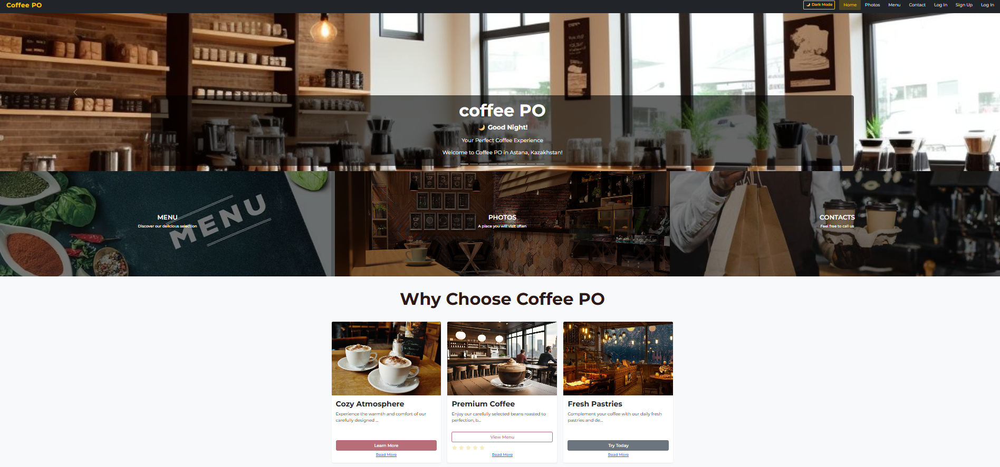
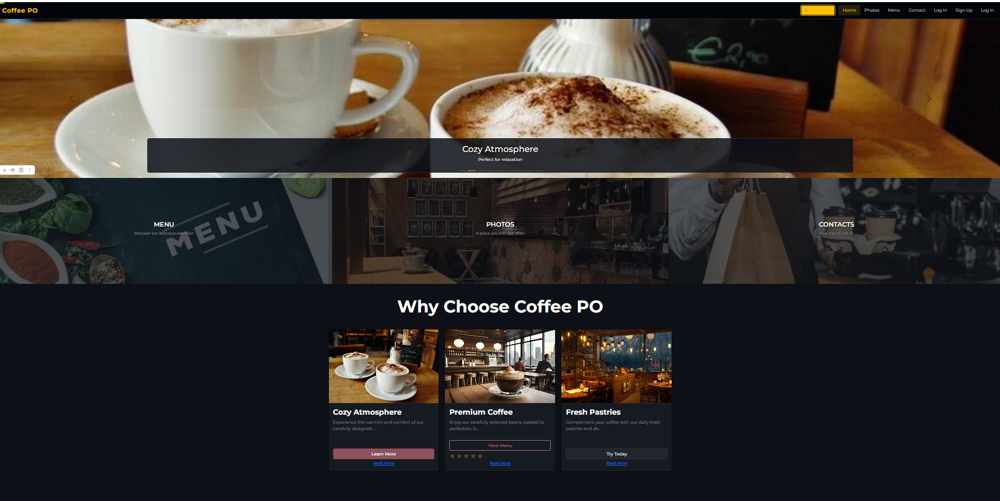

---

### 4.2 Gallery Page (gallery.html)

**Purpose:** Visual showcase of the coffee shop's interior, products, and atmosphere.

**Key Features:**

- **Responsive Grid Layout** - 9 images in Bootstrap card grid
- **Search Functionality** - jQuery-powered search bar to filter images by title
- **Image Cards** - Each card includes image, title, description, and "View Details" button
- **Lazy Loading** - Images load progressively as user scrolls
- **Hover Effects** - Cards elevate and show description overlay on hover

**Layout Behavior:**

- Desktop (≥992px): 3 columns
- Tablet (768-991px): 2 columns
- Mobile (<768px): 1 column (stacked)

**Images:**

- All images optimized for web (compressed without quality loss)
- Aspect ratio maintained with `object-fit: cover`
- Alt text provided for accessibility

**Screenshot:**
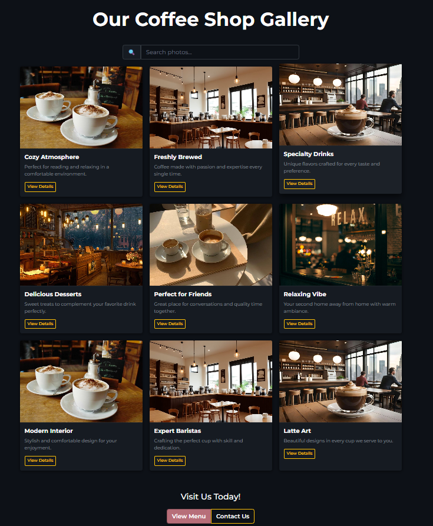
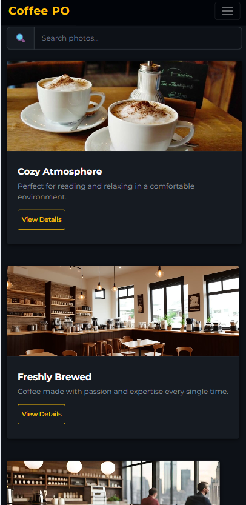
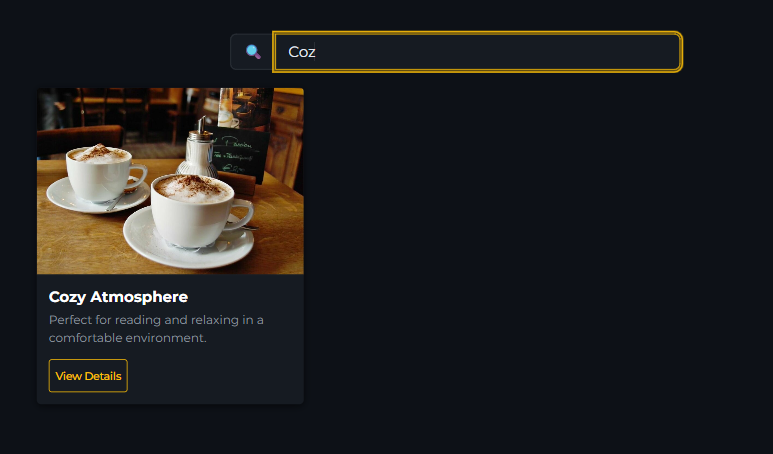

---

### 4.3 Menu Page (menu.html)

**Purpose:** Display coffee and food offerings with prices and descriptions.

**Key Features:**

- **Menu Items Display** - 5 coffee items in horizontal cards
  - Latte (2500 ₸)
  - Cappuccino (2300 ₸)
  - Americano (1800 ₸)
  - Mocha (2800 ₸)
  - Espresso (1500 ₸)
- **Search Functionality** - Real-time search bar that filters menu items
- **Search Suggestions** - Dropdown with autocomplete suggestions
- **Text Highlighting** - Search terms highlighted in yellow in results
- **Rating System** - 5-star rating for each item with click interaction
- **Special Offers Alert** - Bootstrap alert with subscription popup
- **Order Buttons** - Functional buttons that show confirmation and play sound

**Responsive Design:**

- Desktop: Side-by-side image and text
- Tablet: Reduced image size
- Mobile: Stacked layout with centered content

**Interactive Elements:**

- Subscription popup modal (opens on "Get Special Offers" button)
- Sound effects on button clicks using Web Audio API
- Smooth animations on card hover

**Screenshot:**
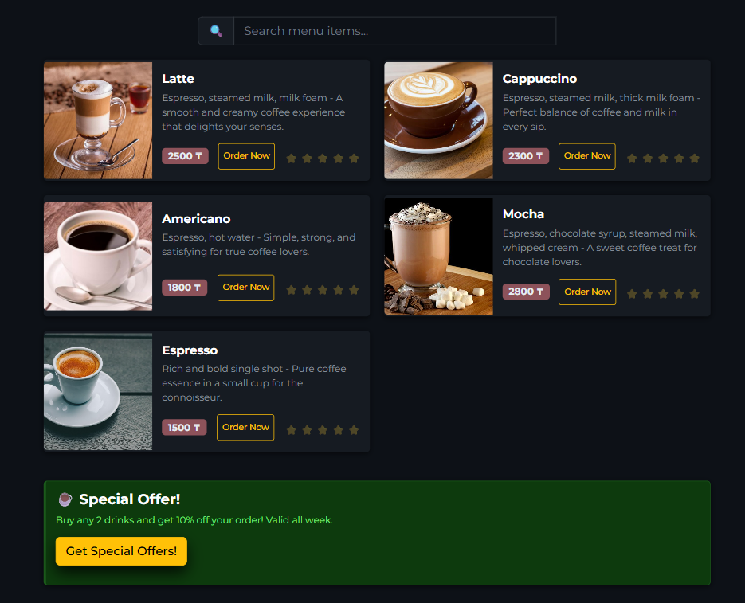
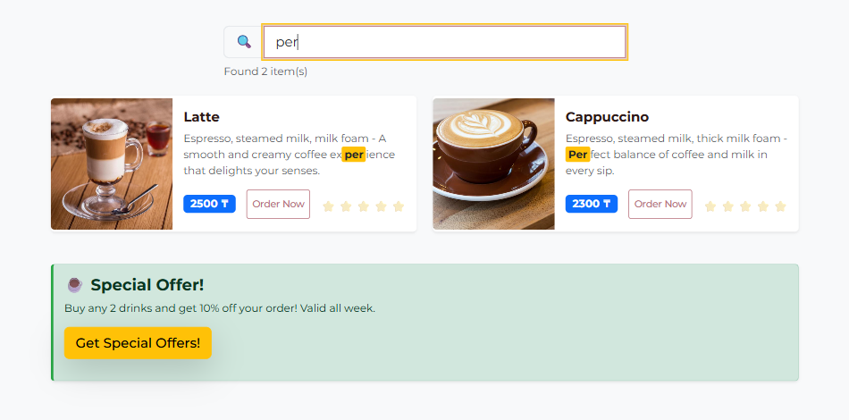
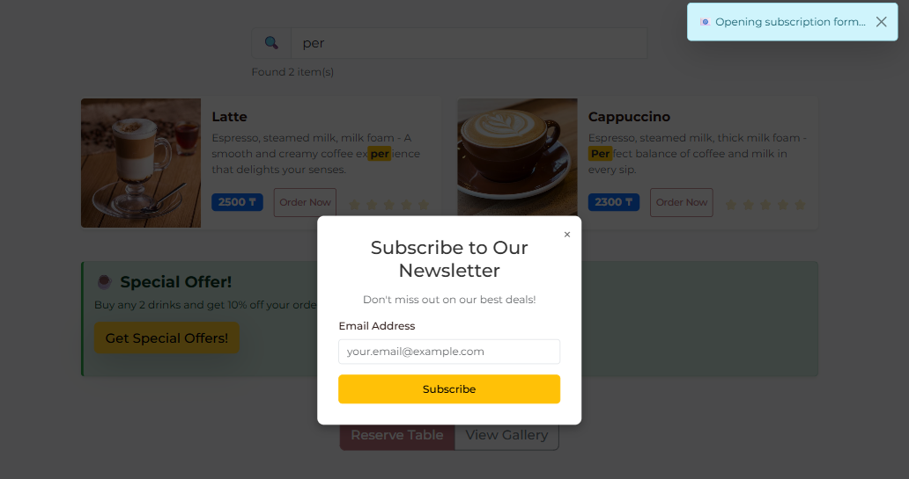

---

### 4.4 Contact Page (contact.html)

**Purpose:** Allow users to send feedback and inquiries to the coffee shop.

**Key Features:**

- **Contact Form** with validation:
  - Name (required, min 2 characters)
  - Email (required, valid format)
  - Subject (dropdown: General Inquiry, Reservation, Feedback, Complaint, Other)
  - Message (required, min 10 characters)
  - Newsletter checkbox
  - Preferred contact method (radio: Email/Phone)
- **Form Validation** - Real-time validation with error messages
- **Loading State** - Spinner animation during form submission
- **Success Notification** - Toast notification on successful submission
- **Feedback Integration** - Forms submitted by logged-in users save to profile history
- **Contact Cards** - Phone and location information with copy buttons

**Form Processing:**

1. Client-side validation checks all fields
2. If valid, shows loading spinner
3. Saves to user's feedback array in localStorage (if logged in)
4. Displays success notification
5. Resets form

**jQuery Enhancements:**

- Copy-to-clipboard buttons for phone numbers
- Animated form submission with fade effects
- Notification system with auto-dismiss

**Screenshot:**
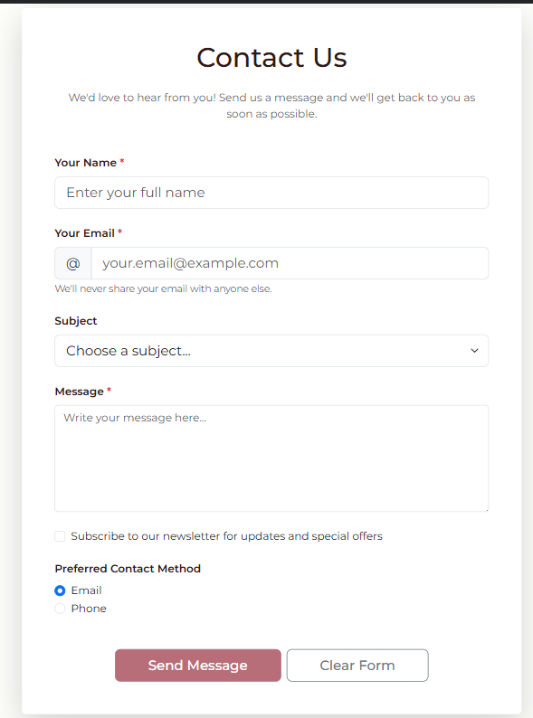
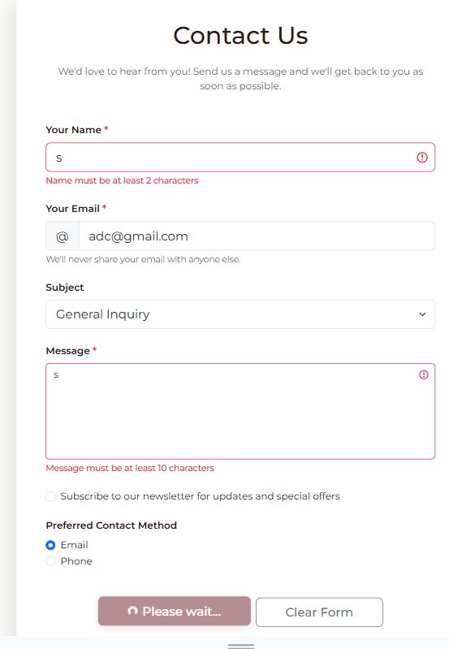
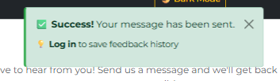

---

### 4.5 Sign Up Page (signup.html)

**Purpose:** Allow new users to create an account.

**Key Features:**

- **Registration Form** with fields:
  - Full Name (required, min 2 characters)
  - Email (required, unique, valid format)
  - Password (required, min 8 chars, uppercase, lowercase, number)
  - Confirm Password (must match)
  - Phone Number (optional, Kazakhstan format: +7 XXX XXX-XX-XX)
  - Terms & Conditions checkbox (required)
- **Password Toggle** - Eye icon to show/hide password
- **Real-time Validation** - Errors display immediately below fields
- **Password Strength Indicator** - Hint text explaining requirements
- **Email Uniqueness Check** - Prevents duplicate registrations
- **Success Message** - Confirmation before redirect to login

**Validation Rules:**

```javascript
Email: /^[^\s@]+@[^\s@]+\.[^\s@]+$/;
Password: /^(?=.*[a-z])(?=.*[A-Z])(?=.*\d).{8,}$/;
Phone: /^\+?7\s?\(?\d{3}\)?\s?\d{3}[-\s]?\d{2}[-\s]?\d{2}$/;
```

**User Data Stored:**

```javascript
{
  id: Date.now(),
  fullName: string,
  email: string,
  password: string, // Note: In production, should be hashed
  phone: string,
  createdAt: ISO date string,
  visits: 0,
  feedback: []
}
```

**Screenshot:**
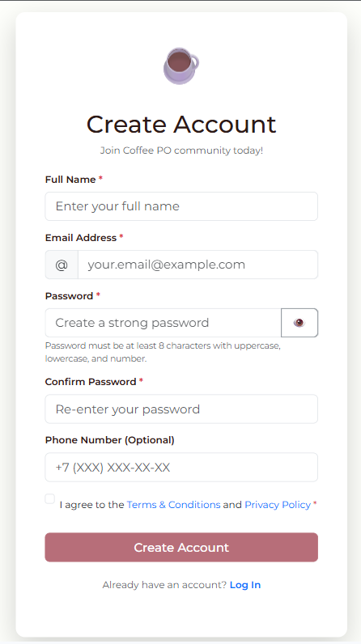

---

### 4.6 Login Page (login.html)

**Purpose:** Authenticate existing users and grant access to profile.

**Key Features:**

- **Login Form** with fields:
  - Email (required, valid format)
  - Password (required)
  - Remember Me checkbox
  - Forgot Password link (placeholder)
- **Authentication Logic**:
  1. Retrieves users array from localStorage
  2. Finds user with matching email and password
  3. Updates visit count
  4. Creates session in localStorage
  5. Redirects to profile page
- **Error Handling** - Clear error messages for invalid credentials
- **Loading State** - Spinner during authentication
- **Demo Credentials Info** - Helpful text for testing

**Session Data Stored:**

```javascript
{
  userId: number,
  email: string,
  fullName: string,
  loginTime: ISO date string
}
```

**Security Considerations:**

- Note: This is client-side authentication for demonstration
- In production, would use backend authentication
- Passwords should be hashed (bcrypt)
- Sessions should use JWT tokens

**Screenshot:**
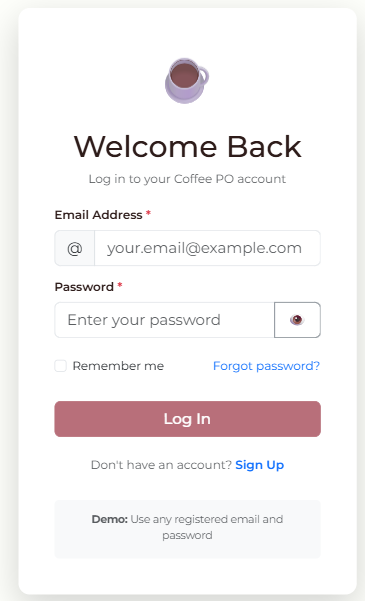

---

### 4.7 Profile Page (profile.html)

**Purpose:** Display user information and feedback history.

**Key Features:**

**A. User Information Card:**

- Avatar circle with user initials
- Full name and email
- Phone number
- Member since date
- Statistics: Feedback count, Visit count
- Edit Profile button (opens modal)
- Logout button

**B. Feedback History Section:**

- Search bar to filter feedback
- Subject filter dropdown
- List of all submitted feedback with:
  - Subject line
  - Date and time
  - Message content
  - Status badge
- "Clear All History" button
- Empty state message if no feedback

**C. Edit Profile Modal:**

- Update full name
- Update phone number
- Email cannot be changed (security)
- Save/Cancel buttons

**Profile Features:**

- **Protected Route** - Redirects to login if not authenticated
- **Real-time Search** - Filter feedback by keyword
- **Subject Filter** - Filter by feedback category
- **Feedback Sorting** - Newest first by default
- **Data Persistence** - All changes saved to localStorage

**Data Flow:**

1. Page loads → Check authentication
2. If authenticated → Load user data from localStorage
3. Display profile info and feedback history
4. User interactions → Update localStorage
5. Changes reflect immediately

**Screenshot:**
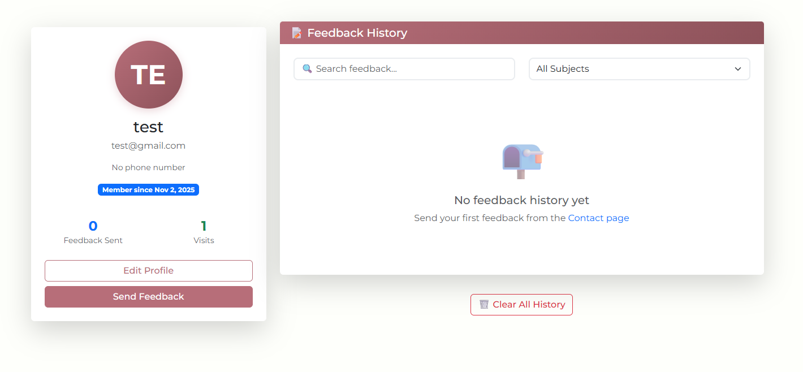
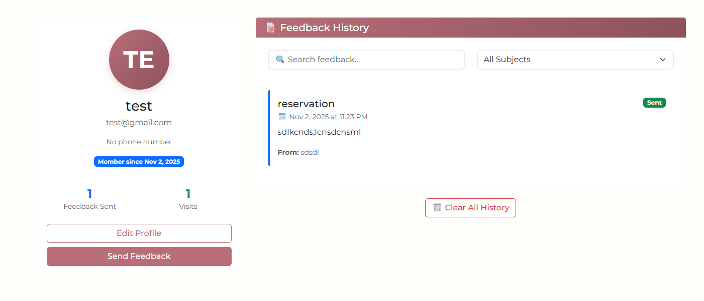

---

### 4.8 Navigation System

**Dynamic Navigation:**
The navigation bar adapts based on user authentication status:

**When NOT logged in:**

- Home
- Photos
- Menu
- Contact
- **Sign Up**
- **Log In**

**When logged in:**

- Home
- Photos
- Menu
- Contact
- **Profile**
- **Logout button**

**Implementation (auth.js):**

```javascript
function updateNavigationLinks() {
  const currentUser = JSON.parse(localStorage.getItem("currentUser") || "null");

  if (currentUser) {
    // Show Profile and Logout
  } else {
    // Show Sign Up and Log In
  }
}
```

**Features:**

- Consistent across all pages
- Dark mode toggle button
- Responsive collapse menu on mobile
- Active page highlighting
- Smooth hover transitions

**Screenshot:**
[Insert navigation screenshot - logged out state]
[Insert navigation screenshot - logged in state]
[Insert mobile navigation screenshot]

---

## 5. Responsiveness Implementation

### Breakpoints Used:

- **Extra Small (< 576px):** Mobile phones
- **Small (576px - 767px):** Large phones, small tablets
- **Medium (768px - 991px):** Tablets
- **Large (992px - 1199px):** Small desktops
- **Extra Large (≥ 1200px):** Large desktops

### Responsive Techniques:

**1. Bootstrap Grid System:**

```html
<div class="row">
  <div class="col-lg-4 col-md-6 col-sm-12">
    <!-- Content -->
  </div>
</div>
```

**2. Custom Media Queries:**

```css
@media (max-width: 767px) {
  .carousel-img {
    height: 300px;
  }
  .card-img-top {
    height: 200px;
  }
}

@media (min-width: 768px) and (max-width: 991px) {
  .card-responsive-group > div {
    flex: 0 0 50%;
  }
}

@media (min-width: 992px) {
  .card-responsive-group > div {
    flex: 0 0 33.333%;
  }
}
```

**3. Flexbox & CSS Grid:**

```css
.promo-grid {
  display: flex;
  gap: 0;
}

@media (max-width: 768px) {
  .promo-grid {
    flex-direction: column;
  }
}
```

**4. Responsive Images:**

```css
img {
  max-width: 100%;
  height: auto;
}

.carousel-img {
  object-fit: cover;
}
```

**5. Responsive Typography:**

```css
.responsive-title {
  font-size: clamp(1.5rem, 4vw, 3rem);
}
```

### Testing Results:

| Device        | Screen Size | Layout | Navigation | Forms | Images |
| ------------- | ----------- | ------ | ---------- | ----- | ------ |
| iPhone SE     | 375x667     | ✅     | ✅         | ✅    | ✅     |
| iPhone 12 Pro | 390x844     | ✅     | ✅         | ✅    | ✅     |
| iPad          | 768x1024    | ✅     | ✅         | ✅    | ✅     |
| iPad Pro      | 1024x1366   | ✅     | ✅         | ✅    | ✅     |
| Desktop HD    | 1366x768    | ✅     | ✅         | ✅    | ✅     |
| Desktop FHD   | 1920x1080   | ✅     | ✅         | ✅    | ✅     |

**Screenshot:**
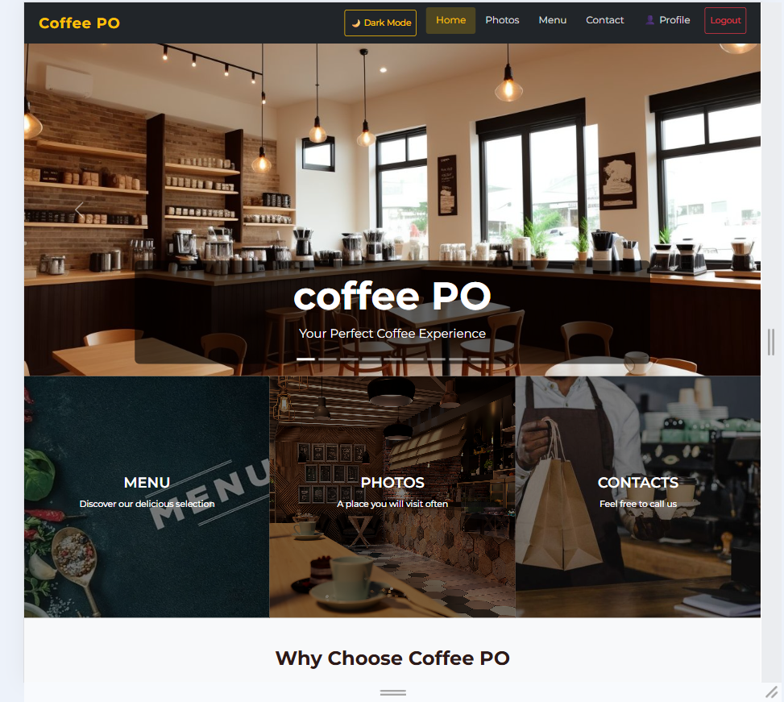
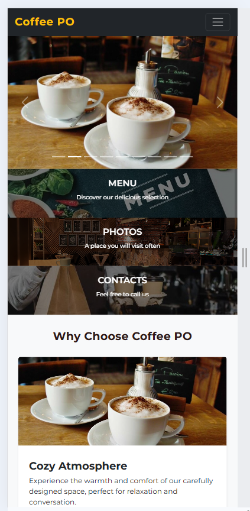

---

## 6. Light and Dark Modes

### Implementation:

**Toggle Button:**

- Located in navigation bar on all pages
- Shows "🌙 Dark Mode" in light mode
- Shows "☀️ Light Mode" in dark mode
- Click toggles between modes

**LocalStorage Persistence:**

```javascript
// Save preference
localStorage.setItem("colorMode", "dark");

// Load on page load
const savedMode = localStorage.getItem("colorMode");
if (savedMode === "dark") {
  document.body.classList.add("dark-mode");
}
```

**Color Schemes:**

**Light Mode:**

- Background: #fefffb (off-white)
- Text: #333 (dark gray)
- Primary: #b76e79 (brown-pink)
- Cards: #ffffff (white)
- Contrast Ratio: 12.63:1 ✅ WCAG AA

**Dark Mode:**

- Background: #0d1117 (GitHub dark)
- Text: #e6edf3 (light gray)
- Primary: #8d525a (muted brown)
- Cards: #161b22 (dark gray)
- Contrast Ratio: 11.91:1 ✅ WCAG AA

**CSS Implementation:**

```css
/* Light Mode (default) */
body {
  background-color: #fefffb;
  color: #333;
}

/* Dark Mode */
body.dark-mode {
  background-color: #0d1117;
  color: #e6edf3;
}

body.dark-mode .card {
  background-color: #161b22;
  border-color: #21262d;
}

body.dark-mode .navbar-dark {
  background-color: #010409;
}
```

**Features:**

- ✅ Consistent across all pages
- ✅ Persists after page refresh
- ✅ Smooth transitions between modes
- ✅ All elements properly styled
- ✅ WCAG AA compliant contrast
- ✅ Readable in both modes

---

## 7. JavaScript Functionality

### 7.1 Authentication Simulation

**Sign Up Process:**

1. User fills registration form
2. Validation checks all fields
3. Check if email already exists
4. Create user object
5. Store in localStorage users array
6. Show success message
7. Redirect to login page

**Login Process:**

1. User enters credentials
2. Validate email format
3. Find user in localStorage
4. Compare passwords
5. Update visit count
6. Create session
7. Redirect to profile

**Profile Access:**

1. Check for currentUser in localStorage
2. If not found → redirect to login
3. Load user data
4. Display profile information
5. Load feedback history

**Code Example:**

```javascript
// Sign Up
const user = {
  id: Date.now(),
  fullName: fullName,
  email: email,
  password: password,
  createdAt: new Date().toISOString(),
  visits: 0,
  feedback: [],
};

const users = JSON.parse(localStorage.getItem("users") || "[]");
users.push(user);
localStorage.setItem("users", JSON.stringify(users));

// Login
const users = JSON.parse(localStorage.getItem("users") || "[]");
const user = users.find((u) => u.email === email && u.password === password);

if (user) {
  const sessionData = {
    userId: user.id,
    email: user.email,
    fullName: user.fullName,
    loginTime: new Date().toISOString(),
  };
  localStorage.setItem("currentUser", JSON.stringify(sessionData));
}
```

---

### 7.2 Form Validation

**Email Validation:**

```javascript
function validateEmail(email) {
  const regex = /^[^\s@]+@[^\s@]+\.[^\s@]+$/;
  return regex.test(email);
}
```

**Password Validation:**

```javascript
function validatePassword(password) {
  // At least 8 characters, 1 uppercase, 1 lowercase, 1 number
  const regex = /^(?=.*[a-z])(?=.*[A-Z])(?=.*\d).{8,}$/;
  return regex.test(password);
}
```

**Phone Validation (Kazakhstan):**

```javascript
function validatePhone(phone) {
  if (!phone) return true; // Optional
  const regex = /^\+?7\s?\(?\d{3}\)?\s?\d{3}[-\s]?\d{2}[-\s]?\d{2}$/;
  return regex.test(phone);
}
```

**Error Display:**

```javascript
function showFieldError(fieldId, message) {
  const field = document.getElementById(fieldId);
  const errorDiv = document.createElement("div");
  errorDiv.className = "invalid-feedback d-block";
  errorDiv.textContent = message;
  field.classList.add("is-invalid");
  field.parentElement.appendChild(errorDiv);
}
```

**Forms with Validation:**

- Sign Up Form: 6 fields validated
- Login Form: 2 fields validated
- Contact Form: 4 fields validated
- Edit Profile Form: 2 fields validated

---

### 7.3 Search and Filtering

**Menu Search:**

```javascript
$("#menuSearch").on("keyup", function () {
  const searchTerm = $(this).val().toLowerCase();
  let visibleCount = 0;

  $(".col-lg-6.col-md-12").filter(function () {
    const cardText = $(this).text().toLowerCase();
    const matches = cardText.indexOf(searchTerm) > -1;
    $(this).toggle(matches);
    if (matches) visibleCount++;
    return true;
  });

  $("#searchResults").text(`Found ${visibleCount} item(s)`);
});
```

**Gallery Search:**

```javascript
$("#gallerySearch").on("keyup", function () {
  const searchTerm = $(this).val().toLowerCase();

  $(".col-lg-4.col-md-6.col-sm-12").filter(function () {
    const cardText = $(this).text().toLowerCase();
    $(this).toggle(cardText.indexOf(searchTerm) > -1);
  });
});
```

**Profile Feedback Filter:**

```javascript
function filterFeedback(userId) {
  const searchTerm = $("#searchFeedback").val().toLowerCase();
  const subjectFilter = $("#filterSubject").val();

  let filteredFeedback = user.feedback;

  // Filter by subject
  if (subjectFilter) {
    filteredFeedback = filteredFeedback.filter(
      (f) => f.subject === subjectFilter
    );
  }

  // Filter by search term
  if (searchTerm) {
    filteredFeedback = filteredFeedback.filter(
      (f) =>
        f.message.toLowerCase().includes(searchTerm) ||
        f.subject.toLowerCase().includes(searchTerm)
    );
  }

  displayFeedbackHistory(filteredFeedback);
}
```

**Search Suggestions:**

```javascript
const menuSuggestions = [
  "Latte",
  "Cappuccino",
  "Americano",
  "Mocha",
  "Espresso",
];

$("#menuSearch").on("input", function () {
  const searchTerm = $(this).val().toLowerCase();
  const matches = menuSuggestions.filter((item) =>
    item.toLowerCase().includes(searchTerm)
  );
  // Display suggestions dropdown
});
```

---

### 7.4 Dynamic Content

**Animated Counters:**

```javascript
$(".counter").each(function () {
  const $this = $(this);
  const target = parseInt($this.attr("data-target"));

  $({ counter: 0 }).animate(
    { counter: target },
    {
      duration: 2000,
      easing: "swing",
      step: function () {
        $this.text(Math.ceil(this.counter) + "+");
      },
    }
  );
});
```

**Lazy Loading Images:**

```javascript
function lazyLoadImages() {
  $(".lazy-image").each(function () {
    const $img = $(this);
    const imgTop = $img.offset().top;
    const viewportBottom = $(window).scrollTop() + $(window).height();

    if (imgTop < viewportBottom + 200) {
      const dataSrc = $img.attr("data-src");
      $img
        .attr("src", dataSrc)
        .removeClass("lazy-image")
        .addClass("lazy-loaded");
    }
  });
}

$(window).on("scroll", lazyLoadImages);
```

**Scroll Progress Bar:**

```javascript
$(window).on("scroll", function () {
  const scrollTop = $(window).scrollTop();
  const docHeight = $(document).height() - $(window).height();
  const scrollPercent = (scrollTop / docHeight) * 100;
  $("#scrollProgress").css("width", scrollPercent + "%");
});
```

---

## 8. Animated Buttons & UI Effects

### Hover Effects:

**Button Transitions:**

```css
.btn {
  transition: all 0.3s ease;
}

.btn:hover {
  transform: translateY(-2px);
  box-shadow: 0 4px 12px rgba(0, 0, 0, 0.15);
}
```

**Card Hover:**

```css
.card {
  transition: all 0.3s ease;
}

.card:hover {
  transform: translateY(-10px);
  box-shadow: 0 12px 24px rgba(0, 0, 0, 0.15);
}
```

**Navigation Links:**

```css
.navbar-dark .navbar-nav .nav-link {
  transition: all 0.3s ease;
}

.navbar-dark .navbar-nav .nav-link:hover {
  color: #ffc107;
  background-color: rgba(255, 193, 7, 0.1);
  transform: translateY(-2px);
}
```

### Click Animations:

**Button Pulse:**

```css
@keyframes pulse {
  0% {
    transform: scale(1);
  }
  50% {
    transform: scale(1.1);
  }
  100% {
    transform: scale(1);
  }
}

.btn:active {
  animation: pulse 0.5s ease;
}
```

**Form Validation Shake:**

```css
@keyframes shake {
  0%,
  100% {
    transform: translateX(0);
  }
  25% {
    transform: translateX(-10px);
  }
  75% {
    transform: translateX(10px);
  }
}

.is-invalid {
  animation: shake 0.5s ease;
}
```

### Scroll Animations:

**Fade In on Scroll:**

```javascript
const observer = new IntersectionObserver(
  function (entries) {
    entries.forEach((entry) => {
      if (entry.isIntersecting) {
        entry.target.style.opacity = "0";
        entry.target.style.transform = "translateY(30px)";

        setTimeout(() => {
          entry.target.style.transition = "all 0.6s ease";
          entry.target.style.opacity = "1";
          entry.target.style.transform = "translateY(0)";
        }, 100);
      }
    });
  },
  { threshold: 0.1 }
);

document.querySelectorAll(".card").forEach((card) => {
  observer.observe(card);
});
```

### Loading States:

**Spinner Animation:**

```html
<button class="btn btn-primary">
  <span class="btn-text">Submit</span>
  <span class="spinner-border spinner-border-sm d-none"></span>
</button>
```

```javascript
// Show loading
submitBtn.querySelector(".btn-text").classList.add("d-none");
submitBtn.querySelector(".spinner-border").classList.remove("d-none");
submitBtn.disabled = true;
```

### Toast Notifications:

```javascript
function showNotification(message, type) {
  const notification = $(`
        <div class="alert alert-${type} alert-dismissible fade show">
            ${message}
            <button type="button" class="btn-close"></button>
        </div>
    `);

  $("#notificationContainer").append(notification);

  setTimeout(() => {
    notification.fadeOut(500, function () {
      $(this).remove();
    });
  }, 4000);
}
```

---

## 9. Accessibility & Navigation

### Navigation Features:

✅ **Consistent Navigation Bar** on all 7 pages
✅ **Active Page Highlighting** shows current location
✅ **Responsive Collapse Menu** for mobile devices
✅ **Keyboard Navigation** - Tab through all links
✅ **Skip to Main Content** link (for screen readers)

### Accessibility Compliance:

**1. Semantic HTML:**

```html
<header>
  <nav aria-label="Main navigation">
    <ul>
      <li><a href="index.html">Home</a></li>
    </ul>
  </nav>
</header>

<main>
  <section aria-labelledby="menu-heading">
    <h1 id="menu-heading">Our Menu</h1>
  </section>
</main>

<footer>
  <address>Contact information</address>
</footer>
```

**2. Alt Text for Images:**

```html


```

**3. Heading Structure:**

```html
<h1>Coffee PO</h1>
<h2>Our Menu</h2>
<h3>Hot Drinks</h3>
<h3>Cold Drinks</h3>
<h2>About Us</h2>
```

**4. ARIA Labels:**

```html
<button aria-label="Toggle dark mode">🌙 Dark Mode</button>
<input type="search" aria-label="Search menu items" />
<nav aria-label="Main navigation"></nav>
```

**5. Keyboard Navigation:**

```css
/* Focus indicators */
a:focus,
button:focus,
input:focus {
  outline: 2px solid #ffc107;
  outline-offset: 2px;
}
```

```javascript
// Arrow key navigation
document.addEventListener("keydown", function (event) {
  if (event.key === "ArrowRight") {
    // Navigate to next link
  }
});
```

This code demonstrates accessibility best practices to make the site usable for everyone, including users with disabilities.

**Key Points**

Consistent Navigation across all pages
Mobile-friendly menu + active link highlight
Keyboard-friendly (Tab navigation + visible focus)
Skip to Content link for screen readers
Semantic HTML (header, nav, main, footer)
Proper alt text for all images
Correct heading hierarchy (h1 → h2 → h3)
ARIA labels for screen readers
Optional arrow-key navigation logic in JS

## ✅ Conclusion

Our coffee restaurant website is a fully functional, responsive, and user-friendly web application. We implemented a clean UI and smooth navigation across all pages, ensuring an intuitive user experience on both desktop and mobile devices.

Using HTML5, CSS3, JavaScript, and Bootstrap, we built modern and aesthetically pleasing pages with interactive features like menus, forms, and navigation effects. Accessibility principles and semantic structure were applied to make the site usable for all visitors.

In the end, the project successfully demonstrates a real-world restaurant website that reflects professionalism, attention to detail, and practical front-end development skills.
